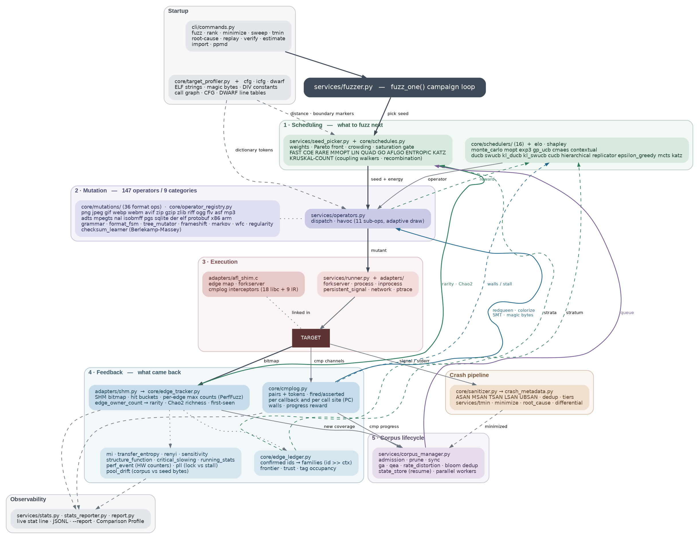

# fuzzer-tool

[](https://deepwiki.com/daedalus/fuzzer)

**Information-dense, coverage-guided binary fuzzer**: 147 mutation operators across 9 categories, 14 bandit and optimizer scheduler modules under Elo arbitration, AFL-style forkserver and SHM edge coverage, comparison tracing down to the individual call site, and information-theoretic seed scoring.

> **Honest caveat**: This is probably the most complex fuzzer from an information-theory standpoint, and also the slowest raw-throughput. The tradeoff is speed for edge-discovery novelty. For production fuzzing at scale, AFL family fuzzers remain the best choice.

---

## Architecture



The campaign loop runs down the dark spine — pick a seed, mutate it, execute it, measure what
came back — and the coloured edges on the right are the return paths that close it:

| Colour | Return path |
|---|---|
| green | coverage and operator reward feeding scheduling (`rarity · Chao2`, `reward`) |
| blue | comparison signal feeding mutation and stall detection (`redqueen · colorize · SMT`, `walls / stall`) |
| purple | corpus queue feeding seed selection |

Boxes are *subsystems*, not files — one box can cover several modules — but every module path
in the diagram is a real path under `src/fuzzer_tool/`. Source is
[`docs/architecture.dot`](docs/architecture.dot); regenerate with:

```bash
dot -Tpng -Gdpi=130 docs/architecture.dot -o docs/images/architecture.png
dot -Tsvg            docs/architecture.dot -o docs/images/architecture.svg
```

---

## Quick Start

```bash
pip install -e ".[dev]"

# Basic fuzzing — coverage-guided by default
fuzzer-tool fuzz ./target

# With a dictionary
fuzzer-tool fuzz -D dictionary.txt ./target

# In-process mode (fastest for .so targets)
fuzzer-tool fuzz libfoo.so --inprocess

# Blind mutation, no edge bitmap (crash detection still works)
fuzzer-tool fuzz ./target --no-coverage

# With Markov generation + Monte Carlo bandit
fuzzer-tool fuzz --markov --markov-gen --mc-bandit --mc-cem ./target

# Resume a previous session
fuzzer-tool fuzz ./target --resume
```

---

## Core Capabilities

### Mutation Engine

**147 operators in 9 categories.** Every scheduler picks from the same registry, and
`REGISTRY.register_mutator()` adds operators at runtime without a restart.

| Category | Count | Representative operators |
|---|---|---|
| `bit` | 11 | `bit_flip`, `bit_rotate`, `bit_shift`, `span_invert`, `bit_repack`, `bit_transpose_{8,16,32,64}` |
| `byte` | 15 | arithmetic 1/2/4/8-byte LE/BE, interesting-value overwrite, byte flips |
| `block` | 14 | insert/delete/duplicate/swap/clone, block splice |
| `dict` | 8 | `dict_insert`/`append`/`prepend`/`overwrite`, `dict_compound`, `checksum_repair` |
| `structural` | 20 | `splice_common_prefix`, `crossover`, `elite_fuse`, `tlv_mutate`, `token_shuffle`, `special_strings`, `punctuation_insert`, `versifier_generate` |
| `radamsa` | 7 | `tree_mutate`, `line_mutate`, `fuse_this`/`fuse_next`/`fuse_old`, `utf8_widen`, `utf8_insert` |
| `format` | 36 | one `*_chunk_mutate` per container format, plus `format_lock`, `field_repair`, `png_crc_fix`, `recompress_{gzip,zlib}` |
| `regularity` | 14 | `spectral_peak`, `rank_deficient`, `monotone_fill`, `kmer_saturate`, `popcount_lock`, `birthday_collide`, `gcd_worst_case`, `float_squeeze` |
| `adaptive` | 22 | `havoc`, `redqueen`, `colorization`, `condstmt_solve`, `gradient_descent`, `magic_byte_search`, `crc_learn`, `markov_bytes`, `cem_bytes`, `path_negate`, `skipdet_probe` |

**Regularity operators** are the statistical batteries run backwards: instead of testing a
buffer for randomness, they synthesise inputs that are *pathologically* regular — spectral
peaks, rank-deficient matrices, k-mer saturation, worst-case GCD pairs, popcount locks. They
target the code that assumes its input looks random (hash tables, geometry, samplers).

**Adaptive havoc**: the 11 inline havoc sub-mutations are drawn by inverse-CDF sampling from
per-sub-operator reward instead of uniformly (`--no-adaptive-havoc` restores uniform draws).

**FrameShift** auto-adjusts length fields after a mutation resizes the region they describe.

**Grammar-aware**: format-specific structural mutations for PNG (IHDR/IDAT/CRC/filter/interlace), JPEG (SOF/DHT/DQT/DRI/SOS), BMP (header/pixel), gzip/zlib (CMF/FLG/Adler-32), **PGS** (PCS/WDS/PDS/ODS/END segment mutations), **ISO-BMFF** (box-type/size/container nesting/codec/handler mutations for MP4/MOV), **NAL** (H.264/H.265 NAL unit type/ref_idc/SPS/PPS/slice mutations), **MPEG-TS** (sync/PID/adaptation-field/PAT-PMT mutations), **ADTS** (AAC frame_length/profile/sampling-rate/channel-config mutations), **MP3** (bitrate/sampling-rate index/version/layer mutations), **Ogg** (page header_type/granule/serial/segment-table mutations), **FLV** (tag type/data_size/timestamp/stream_id mutations), **ASF** (GUID-object size/type/header-count mutations), **RIFF** (AVI/WAV chunk size/fourcc/LIST-type mutations), **Protobuf** (tag/wire-type/varint/length re-encode, field splice/duplicate/delete), **GIF** (LSD/GCT/image/extension/trailer), **WebP** (RIFF chunk type/size/VP8/VP8L/VP8X/ANMF), **WebM** (EBML element ID/size-vint/codec/nest-unnest), **ZIP** (LFH/CD/EOCD fields, crc/name/method), **AVIF** (AV1 item/property/`mdat` box mutations over the ISO-BMFF container), **SQLite** (page header/b-tree cell/freeblock/schema-page mutations — sniffed on the 16-byte magic, so the DB image must stay at offset 0), **DER** (tag/length/TLV insert/reorder for ASN.1), **ELF** (header/section/segment field mutations), **x86/x86-64** (opcode-class, modrm, imm/disp, insn delete/duplicate/swap/splice), **ARM** (A32/T32 word-level). **Format lock**: magic-prefix detection with protected-byte-tail-havoc for autoprobe targets. **Tree mutator**: Radamsa-style delimiter-based mutations (delete, duplicate, swap, stutter) with correct round-trip invariants.

**Checksum learning** (Berlekamp-Massey): recovers unknown linear checksum polynomials from observed (data, checksum) pairs — format-aware PNG/ZIP/GZIP extraction plus cmplog heuristics — then the `crc_learn` operator patches checksum fields with the recovered model. Targets using non-standard CRC polynomials or proprietary linear checksums become fuzzable instead of opaque. All CRC-32 computation routes through a configurable wrapper (`core/crc32.py`): hardware `zlib.crc32` for the standard polynomial, software LFSR for recovered non-standard ones.

### Coverage & Execution
- **AFL SHM bitmap** with sparse 8-byte entry hash table — no silent bucket collisions
- **Forkserver** (default, `--no-forkserver` to opt out): `afl_shim.c` installs an AFL-style
  forkserver in its constructor, so the target is exec'd once and each input costs a `fork()`
  from a fully initialised process — 2.77x end to end, 5.27x on a light target
- **Ptrace edge coverage** + Capstone x86-64 decoder for closed-source binaries
- **In-process direct** (`--inprocess-direct`): ctypes calls at 2k–34k eps with sigsetjmp crash survival
- **Hardware perf counters** via `perf_event_open`: instruction, branch, branch-miss counts
- **AFLGo directed fuzzing**: harmonic call-graph + CFG distance to targets (function names, addresses, or `file.c:line` via pure-Python DWARF), with the exact AFLGo power schedule (`--schedule aflgo --t-x N`) and a runtime SHM-tail distance channel on `trace-pc` builds (`build_targets.sh --distance`)
- **n-gram edge coverage** (`build_targets.sh --ngram`): k=2 keeps byte-identical legacy edge ids; k=3+ hashes a predecessor ring with FNV-1a for path-sensitive feedback — `png_read_ng2.so` / `png_read_ng3.so` ship with trace-pc vendored libpng/zlib and feed the K-Scheduler node channel
- **PerfFuzz-style hit-count maxima**: a per-edge high-water mark of execution count, so an
  input that runs the *same* edges far more times than any predecessor is interesting even
  with zero new edges — the signal that finds algorithmic blowups, not just new branches
- **Execution dedup** (`--no-dedup-execs` to disable): a bloom filter over already-executed
  mutants, so a re-derived input never costs a target run
- **Persistent mode** (`--persistent`) for AFL-loop targets, no fork per iteration

### Campaign Modes
- **Parallel workers** (`--jobs N`, `--sync-interval`): independent workers over a shared
  corpus directory with periodic queue sync
- **Network targets** (`--net-host`/`--net-port`/`--net-proto`/`--net-settle-ms`): drive the
  input over TCP/UDP into a listening server instead of stdin or a file
- **Differential fuzzing** (`--differential`): run every input through a second target and
  flag return-code, stdout, or sanitizer-signature divergence, with drift tracking
- **Multi-target**: several binaries, shared corpus, weighted round-robin

### Scheduling Intelligence
| Strategy | Flag | Description |
|----------|------|-------------|
| **Elo arbitration** | `--elo` | Combined operator + seed scheduling via Bayesian Elo rating; all strategies run in shadow |
| Thompson sampling | `--mc-bandit` | Beta-posterior bandit with Brier calibration |
| CEM byte distribution | `--mc-cem` | Cross-Entropy Method for value-level learning |
| MOpt PSO | `--mopt` | Particle swarm optimization over operator distributions |
| Replicator dynamics | `--replicator` | Evolutionary game theory — operators grow by fitness |
| EXP3 | `--exp3` | Adversarial bandit for non-stationary rewards |
| Epsilon-greedy | `--eps-greedy` | Classic exploration/exploitation with annealing |
| Hierarchical bandit | `--hierarchical-bandit` | Two-level: category → operator Thompson sampling |
| GP-UCB | `--gp-ucb` | Gaussian Process UCB with RBF kernel covariance |
| CMA-ES | `--cma-es` | Covariance-matrix adaptation over the continuous operator-weight vector |
| LinUCB contextual | `--contextual` | Ridge-regression contextual bandit — operator choice conditioned on a seed feature vector |
| Discounted UCB | `--ducb` | UCB with geometric discounting for non-stationary reward |
| Sliding-window UCB | `--swucb` | UCB over the last `--swucb-window` pulls only |
| Combinatorial UCB | `--cucb` | CUCB over operator *sets* rather than single arms |
| MCTS / UCT | `--mcts` | Tree search for seed selection over the mutation lineage forest |
| Boltzmann seeds | `--boltzmann` | P(seed) ∝ exp(−E/T) with E = log(fuzz_count + 1), annealed |
| Metropolis admission | `--metropolis` | Accept non-improving inputs with P = exp(−ΔE/T) |
| Secretary stopping | `--secretary` | Optimal-stopping rule for seed/operator/corpus switching |
| honggfuzz power factors | `--honggfuzz` | Novelty decay, freshness, fertility, density, entropy and timeout penalties |
| AFL++ power schedules | `--schedule` | FAST/COE/RARE/MMOPT/LIN/QUAD/GO/AFLGO/ENTROPIC seed-level energy |
| AFLGo directed annealing | `--schedule aflgo` | Exact AFLGo power factor — symmetric 32×/1/32× energy by distance-to-target with time-based cooling (`--t-x`, `--aflgo-cooling`) |
| Entropic power schedule | `--schedule entropic` | libFuzzer `-entropic`: energy ∝ log(1 + rare-feature count) from already-tracked rare-edge ownership |
| **K-Scheduler Katz centrality** | auto | On trace-pc targets: whole-program ICFG → horizon graph (contracted visited deletion, DAG) → out-degree Katz with β from node-hit counts; Elo-rated `katz` seed arm plus a clamped `--schedule katz` energy |
| Seed strategies | — | Weighted, Pareto, format-aware, GA, QEA, Bayesian, Markov-gen |
| **Mutation lineage tree** | `--lineage` | Weighted parent/ops/sites forest per seed: unproductive-branch pruning in auto-minimize, causal crash-path replay in `tmin`, LCA-based diversity scoring |

#### The rarity signal underneath

Every energy schedule above is only as good as its notion of a "rare" edge, and there are two
very different quantities that can play that role: how many *seeds own* an edge (incidence)
and how many *times* the edge was executed (volume). Only the first is rarity. Seed weighting,
`minimize` set-cover ordering, and the richness estimator all run off `edge_owner_count` —
incidence — with a `log2` rarity bonus applied once and a crowding penalty on edges many seeds
already cover. Owner counts are rebuilt on corpus prune, so evicted seeds stop being credited.

Corpus **richness and crash ETA** use a Chao2 incidence estimator (bias-corrected branch under
Q2 < 10, Chao 1987 variance, log-transformed 95% interval) rather than a Good-Turing frequency
spectrum, which is the wrong sampling model for edges that are counted per-seed.

Edge ids are `prev_loc ^ cur_loc`, so the id axis carries no metric structure. The
Wasserstein/KS/CRPS diversity family is therefore computed over the `log2(1 + hit count)` axis,
and coverage *proximity* is the fraction of a seed's edges discovered in the last quarter of
the coverage clock — not a distance between edge indices.

### Information-Theoretic Scoring
- **Mutual information** (`--mi-guided`): I(byte_position; coverage) guides mutation to positions that control code paths
- **Rényi entropy** (`--renyi-weight`): boosts seeds exercising rare edges
- **Transfer entropy** (`--transfer-entropy`): directional causal flow: byte→edge
- **Shannon entropy rate**: stall detection via flat vs. redistributing entropy
- **Index of Dispersion**: Fano factor resolves genuine stall from bursty exploration
- **Shapley value** (`--shapley`): fair operator credit via co-occurrence frequency
- **Rate-distortion corpus minimization** (`--rate-distortion`): optimal compression preserving diversity

### Evolutionary Lifecycles
- **GA** (`--ga`): bounded population, speciation (MinHash LSH), tournament selection, generational replacement with elitism
- **QEA** (`--qea`): quantum-inspired amplitude encoding, rotation gate feedback, collapse-only evaluation
- **WFC** (`--wfc`): Wave Function Collapse constraint-satisfaction generation for chunk reordering and 2D pixel data

### Comparison Tracing (cmplog)
- **Symbol-based**: 18 libc interceptors (`memcmp`/`strcmp`/`strncmp`/`memmem`/`strstr`/
  `strcasestr`/`strpbrk`/…) compiled into the target or `LD_PRELOAD`ed
- **Compiler-IR** (`trace-cmp`): clang `-fsanitize-coverage=trace-pc-guard,trace-cmp` catches
  inlined and constant-folded comparisons through 9 `__sanitizer_cov_trace_*` callbacks
  (`trace-cmp` alone emits nothing — it needs a coverage level alongside it)
- **Redqueen / colorization** (`--colorize`): input-to-comparison operand matching with
  taint-approximating byte colorization
- **SMT solving** (`--enable-smt-z3`): Z3 arithmetic constraint solving from cmplog pairs;
  `--path-negation` solves for inputs that take the opposite branch, `--mod-solving` handles
  modulo constraints

#### Comparison counters

The pair log tells you *what* was compared; it cannot tell you how often, because three layers
of dedup sit between the target and Python and because the record writer discards a satisfied
`strcmp` by construction. So the shim counts in the interceptor itself, ahead of the record
writer, on its own channel:

| Granularity | Channel | What it gives you |
|---|---|---|
| Per callback (27 buckets) | `_CMPLOG_COUNTS` | `fired` and `asserted` per interception site class |
| Per call site | `_CMPLOG_SITE_COUNTS` | the same two counts keyed by `__builtin_return_address(0)` |

Counts are dumped as **deltas** zeroed on write (at reset, flush, `fini`, and both crash
handlers), so the Python-side sum is correct in subprocess, `direct_lite`, and persistent modes
without the collector knowing anything about process lifetimes. The forkserver zeroes the
tables in the parent before forking, or every comparison made during shim init would be
recounted once per execution forever.

Per-callback granularity blurs, and can invert, the reading. Measured on a target with one
always-satisfied and one never-satisfied `memcmp`: the `memcmp` bucket reports (4, 3) — 75%
satisfied, no wall visible — while per-site reports (3, 3) and (1, 0).

What the counters buy:

- **Comparison walls** — a call site the campaign reaches constantly and never passes
  (evidence floor of 1000 fires, assertion rate under 0.001). Surfaced in the stall reason
  string alongside the Allan-variance noise type, and marked inline in `--report`.
- **Dense progress reward** — an input that satisfies more comparisons in one execution than
  any previous input got further into the parser. Mirrors the coverage high-water mark
  (`_update_max_counts`), joins the `success` disjunction, and gates corpus admission.
  First-solve-per-callback would cap at 27 events for a whole campaign; the *count* is what
  is dense.
- **Visibility check** — at the end of seed calibration, a warning if *zero* comparisons fired
  in the entire pass, plus the per-layer split. If only the compiler-IR layer fires, the target
  is in an inlined-comparison regime and the report names `-fno-builtin-memcmp`. Static
  evidence is useless here: the shim *defines* `memcmp`/`strcmp` as strong symbols, so their
  presence in the symbol table says nothing about whether the target calls them.
- `--report` gains a **Comparison Profile** section; JSONL logs gain `cmplog_cmp_fired` /
  `cmplog_cmp_asserted`.

### Crash Analysis
- ASAN/MSAN/TSAN/LSAN/UBSAN auto-classification
- Levenshtein crash clustering, stack-hash dedup, exploitability tiers
- Crash minimization (delta-debugging with signature pinning)
- Blocklist/allowlist and smaller-crash replacement
- **Root-cause isolation** (`root-cause` subcommand): binary-search the minimal byte diff
  between a passing input and the crashing one, with lineage-guided replay under `--lineage`

### Ready-Made Targets
`tools/vendor_*.sh` fetches the source, `tools/build_targets.sh` builds every variant
(plain, `_nosan`, `.so`, `_asan.so`, `_ubsan.so`) with the shim linked in:

| Target | Library | Notes |
|---|---|---|
| `png_read`, `jpeg_read` | libpng + zlib, libjpeg | `--ngram` adds `_ng2`/`_ng3` flavors here and for most other targets |
| `zlib_read`, `gzip_read` | zlib | |
| `ffmpeg_read` | FFmpeg 7.x | full demux→decode chain; link libraries derived from `ffbuild/config.mak` rather than hardcoded |
| `sqlite_read` | SQLite amalgamation | `deserialize` + `integrity_check` + full table scan, sandboxed to `:memory:` with an authorizer and a hard heap limit; **no mode byte**, so the 16-byte magic stays at offset 0 for the mutator sniffer |
| `lz4_read` | LZ4 | block and frame APIs |
| `secp256k1_read` | libsecp256k1 | |
| `grep_read`, `fgrep_read` | GNU grep, fgrep | |
| `fuzzgoat_read`, `unrar_read`, `tailslayer_read` | third-party | |
| `test_target`, `nop_target`, `heap_oob_target`, `asan_target`, `ubsan_target`, `tracecmp_target` | synthetic | fixtures with known-planted bugs, used by the test suite |

### Static Target Analysis (`TargetProfiler`)
- ELF analysis: string constants, magic bytes, DIV/IDIV constant extraction
- Auto-populated dictionary from `.rodata`
- Format-aware seed generation (PNG, JSON, XML, HTML from inferred format)
- Hot-function weighting and crash ETA estimation

### Observability
Live stat line shows: GA/QEA gen/pop/species, MI observations, Elo meta-strategy, Replicator dynamics, Jaccard redundancy, Wasserstein diversity, mutual information, transfer entropy, FrameShift relations, Markov context count. Full explainability report via `--report`.

### Distribution Diagnostics
Online running statistics (Welford/Pébay) for mean, variance, skewness, excess kurtosis — detect tail-risk inputs, critical slowing down, corpus bloat pre-warning, and per-operator reward stability.

---

## Coverage Modes

Coverage-guided mode is **on by default**. `--no-coverage` turns it off:
crash and timeout detection still work, but the edge bitmap stays empty, so
corpus growth and coverage-guided scheduling are inactive. Measured cost of
having it on, 1500 execs x 2 reps: 1.4% throughput on `targets/test_target`,
7.8% on `targets/png_read` — against a corpus that otherwise never grows past
its seeds. `-c`/`--coverage` are still accepted and are now no-ops.

If the target was not built with instrumentation the bitmap cannot fill, and
the run reports that at startup rather than looking healthy while discovering
nothing. Build with `tools/build_targets.sh`.

| Mode | Flag | Throughput |
|------|------|-----------|
| SHM bitmap + forkserver | *(default)* | 0.5k–1.4k eps |
| SHM bitmap, spawn per exec | `--no-forkserver` | 65–500 eps |
| In-process subprocess | `--inprocess` | 65–120 eps |
| In-process direct | `--inprocess-direct` | 2k–34k eps |
| Ptrace basic | `--no-shm` | ~20 eps |
| Ptrace deep | `--no-shm --deep-coverage` | ~18 eps |
| Blind (no edge bitmap) | `--no-coverage` | as target allows |

---

## Feature Compatibility Matrix

Not every feature works in every execution mode — the constraints come from
where a *process boundary* exists. A mode that loads the target into the
fuzzer's own address space has no signal-carrying boundary to attach a
tracer to; a mode that forks per call does.

### Execution modes × features

| Feature | direct (`--inprocess-direct`) | subprocess (`--inprocess`) | SHM / exec (default) | ptrace (`--no-shm`) |
|---|---|---|---|---|
| Edge coverage (AFL bitmap) | ✅ | ✅ | ✅ | ✅ (via breakpoints) |
| Fault address (`si_addr`) | ✅ ¹ | ✅ | ✅ | ✅ |
| Register capture at crash | ✅ ¹ | ✅ | ✅ | ✅ |
| cmplog / redqueen | ✅ ² | ✅ | ✅ | ✅ |
| trace-cmp (compiler IR) | ✅ ² | ✅ | ✅ | ✅ |
| ASAN targets | ⚠️ ³ | ✅ | ✅ | ✅ |
| UBSAN targets | ✅ | ✅ | ✅ | ✅ |
| MSAN targets | ❌ ⁴ | ❌ ⁴ | ✅ | ✅ |
| TSAN targets | ❌ ⁴ | ❌ ⁴ | ✅ | ✅ |
| Sanitizer report parsing (stderr) | ✅ | ✅ | ✅ | ✅ |
| Persistent (no re-exec) | ✅ | ✅ | ❌ | ❌ |

¹ direct mode has no process boundary to attach at, so a crashing input is
re-run once through a ptrace'd one-shot loader for triage. Costs an extra
execution only on the rare crashing input, not on the hot path.

² Requires the cmplog/trace-cmp shim to be *compiled into* the target `.so`
(`build_targets.sh --cmplog` / `--tracecmp`, on by default), or externally
`LD_PRELOAD`ed. `LD_PRELOAD` alone cannot work for a `.so` opened with
`ctypes.CDLL` into an already-running process — the fuzzer auto-detects this
and falls back to the persistent subprocess loader.

³ ASAN `.so` targets need `libasan` preloaded before the interpreter starts;
without it the fuzzer automatically falls back to the subprocess loader.

⁴ MSAN and TSAN instrument the *whole process*. Loading such a target into
the uninstrumented CPython host reports on Python's own memory, so these are
built as standalone executables only (`--msan` / `--tsan`) and run through
the exec path.

### Sanitizer build variants

| Sanitizer | Flag | Finds | Notes |
|---|---|---|---|
| ASAN | (default) | heap/stack overflow, UAF, double-free | executables + `.so` |
| UBSAN | (with ASAN) | integer overflow, bad shifts, misaligned access | `.so`, clang |
| MSAN | `--msan` | use-of-uninitialized-value | clang only, executables only; **ASAN cannot detect this class at all**. Targets linking uninstrumented system libs (libpng/libz/libjpeg) are skipped — they would report false positives unless those libraries are rebuilt instrumented. |
| TSAN | `--tsan` | data races, lock-order inversion, thread leaks | executables only; built with clang (gcc also supports `-fsanitize=thread` if you build manually). Relevant for threaded targets. |

### Compiler support

`clang` is the default compiler, and it matters: **it is the only compiler
that can produce full automatic edge coverage here.**

| Capability | gcc | clang |
|---|---|---|
| Target + `.so` builds | ✅ | ✅ (default) |
| AFL edge instrumentation shim | ✅ | ✅ |
| cmplog shim (libc interposition) | ✅ | ✅ (preferred) |
| Manual `__afl_map_edge()` coverage | ✅ | ✅ |
| **Automatic edge coverage** (`-fsanitize-coverage=trace-pc-guard`) | ❌ ⁵ | ✅ required |
| trace-cmp instrumentation | ⚠️ ⁵ | ✅ required |
| MSAN (`-fsanitize=memory`) | ❌ | ✅ required |
| TSAN (`-fsanitize=thread`) | ✅ | ✅ (used) |
| DWARF 4 + DWARF 5 line tables | ✅ | ✅ |

#### ⁵ The gcc edge-coverage limitation

gcc's `-fsanitize-coverage=` accepts only `trace-pc` and `trace-cmp` — not
the `trace-pc-guard` variant the AFL shim's edge callbacks are built on. The
one gcc-compatible callback the shim does implement,
`__sanitizer_cov_trace_pc()`, is compiled into every shim build
(`__AFL_DISTANCE_MODE` defaults to 1; `-D__AFL_DISTANCE_MODE=0` drops it).
It depends on the AFLGo distance SHM but degrades gracefully without one:
an unmapped segment leaves the lookup table NULL and the callback returns
early. There is currently no measured standalone `trace-pc` path for gcc.

gcc targets therefore fall back to the hand-placed `__afl_map_edge()` calls
in the target wrapper sources. Those see the wrapper's own branching, but not
the branching inside the library being fuzzed. Measured on
`targets/png_read.c` with an identical seed:

| Build | Instrumented call sites | Bitmap slots populated |
|---|---|---|
| gcc — manual `__afl_map_edge` only | 0 automatic | 43 |
| clang `--clang-scov` (`trace-pc-guard`) | 192 | **127** |

gcc still builds every target correctly and remains a supported fallback; it
just yields shallower coverage. Everything downstream that consumes the edge
signal — seed scheduling, MI/TE/sensitivity position weighting, Elo/bandit
operator scheduling, stall detection — is only as good as that signal.

> **Note:** automatic edge coverage is opt-in via `--clang-scov`. A plain
> `build_targets.sh` produces manual-instrumentation-only targets on *either*
> compiler. Pass `--clang-scov` when coverage depth matters — verified on
> `targets/png_read`: 0 instrumented call sites without it, 194 with.

Regardless of the default, the build script selects `clang` automatically for
the features that require it (trace-pc-guard, trace-cmp, UBSAN, MSAN, sancov),
so those work even when `DEFAULT_CC` is gcc.

#### Vendored libraries: required for real coverage depth

Compiler flags only instrument code the build actually compiles. A target
linking a *system* library (`-lpng`, `-lz`, `-ljpeg`) gets zero edges from
inside that library no matter which compiler or coverage flag is used — the
library was built by your distro without instrumentation, and the target only
sees it across a `.so` boundary. What remains instrumented is the thin target
wrapper: `targets/png_read.c` is 175 lines that open a file, call
`png_read_png`, and check the error path.

`vendor/` is gitignored, so a fresh clone silently falls back to system libs.
Nothing fails and the numbers look plausible — the ceiling is just quietly
much lower. Fetch the sources to fix it:

```bash
git clone --depth 1 --branch v1.3.1  https://github.com/madler/zlib.git   vendor/zlib
git clone --depth 1 --branch v1.6.43 https://github.com/pnggroup/libpng.git vendor/libpng
bash tools/build_targets.sh   # look for: "Using vendored trace-cmp libraries"
```

No extra flag is needed — `--cmplog` is on by default, and
`build_simple_so_targets()` links the vendored archives automatically once
they exist. Measured on `targets/png_read.so`, identical corpus and 45s budget:

| Build | `NEEDED` | png syms defined / undefined | Bitmap | Edges (45 s) |
|---|---|---|---|---|
| System libs | `libpng16.so.16`, `libz.so.1` | 2 / 17 | 8 KB | 304 |
| Vendored | *(none)* | 418 / 0 | 16 KB | **1,444** |

To check which one you have:

```bash
readelf -d targets/png_read.so | grep NEEDED     # libpng16.so.16 present => system libs
nm targets/png_read.so | grep -c ' [Tt] png_'    # 2 => system libs, ~418 => vendored
```

A suspiciously low edge plateau on a large, branchy library is usually this —
verify the link before tuning schedulers or dictionaries. See
[`docs/learnings/2026-08-07-uninstrumented-system-libs-coverage.md`](docs/learnings/2026-08-07-uninstrumented-system-libs-coverage.md).

---

## Subcommands

| Command | Description |
|---------|-------------|
| `fuzz` | Run coverage-guided fuzzing |
| `rank` | Rank seeds by edge coverage, rarity, subsumption |
| `minimize` | Greedy set-cover corpus pruning |
| `sweep` | Linear seed replay — find missed crashes |
| `tmin` | Crash delta-debugging minimization |
| `root-cause` | Isolate the minimal byte diff that turns a passing input into a crashing one |
| `replay` | Replay a crash input |
| `verify` | Confirm crashes with ASAN target |
| `estimate` | Crash ETA via Chao2 incidence richness + calibration (`good_turing_estimate()` keeps its name and its old keys for compatibility; the estimator underneath is Chao2) |
| `import` | Import corpus from AFL/libFuzzer/honggfuzz (`--autotokens FILE` also tokenizes the corpus into an AFL-format dictionary) |
| `ppmd` | Analyze corpus compressibility with PPMD |

---

## Documentation

| Document | Contents |
|----------|----------|
| [`docs/architecture.dot`](docs/architecture.dot) | Graphviz source for the subsystem diagram above |
| [`docs/DEEP_DIVE.md`](docs/DEEP_DIVE.md) | Full reference: all features, options, API, building targets |
| [`docs/ASAN-LIMITATION.md`](docs/ASAN-LIMITATION.md) | ASAN in-process limitation & root cause analysis |
| [`docs/tracecmp-howto.md`](docs/tracecmp-howto.md) | Compiler-IR comparison tracing vendor build guide |
| [`docs/inprocess-limitations.md`](docs/inprocess-limitations.md) | In-process execution mode design notes |
| [`docs/TODO.md`](docs/TODO.md) | Roadmap and pending work |
| [`docs/learnings/`](docs/learnings/) | Research spikes and engineering learnings |
| [`docs/FINDINGS/`](docs/FINDINGS/) | Bug discovery reports — one file per bug under `ffmpeg/` and `fgrep/`, see [Trophy Case](#trophy-case) |
| [`AGENTS.md`](AGENTS.md) | Development guide and project conventions |
| [`SPEC.md`](SPEC.md) | Original specification |

---

## Development

```bash
pip install -e ".[dev]"
pytest
ruff check src/ tests/
ruff format src/ tests/
```

Current test suite: **5,400+ tests** across `tests/` and its `core/`, `services/`, `cli/`, and
`integration/` subdirectories, including a large body of regression tests each pinned to a
specific historical bug. Several toolchain-dependent families (`test_cfg_cache`,
`test_distance_aflgo`, `test_icfg`, trace-cmp visibility) skip or fail without `clang`,
`liblzma-dev`, and `libjpeg-dev` installed — compare against a baseline run on the same
machine rather than against an absolute pass count.

---

## Benchmarking

```bash
# 4-way configuration comparison
tools/bench.sh targets/png_read 10000

# Exhaustive feature/combination sweep
tools/bench_sweep.sh
```

---

## Trophy Case

Bugs found by this fuzzer in real software. Each row links to a full report — reproducer,
root cause, ASAN output, and the configuration that found it — under
[`docs/FINDINGS/`](docs/FINDINGS/).

### FFmpeg 7.1.3

Found through [`targets/ffmpeg_read.c`](targets/ffmpeg_read.c), which drives the full
`avformat_open_input → find_stream_info → av_read_frame → send_packet → receive_frame` chain
across every registered demuxer, decoder, and parser, built with ASAN and AFL edge coverage.

| Bug | Severity | Summary |
|---|---|---|
| [Reachable `av_assert0(0)` in the subtitle decoder](docs/FINDINGS/ffmpeg/av_assert0_subtitle_decoder.md) | **HIGH** | `libavcodec/decode.c:464`. The `send_packet`/`receive_frame` API dispatches subtitle decoders into a path asserting the codec type is VIDEO or AUDIO, but subtitle codecs are type SUBTITLE. A 46-byte input aborts any FFmpeg-based application — reliable DoS in release builds. |
| [Integer divide-by-zero in `vpk_read_packet`](docs/FINDINGS/ffmpeg/vpk_divide_by_zero.md) | Medium | `libavformat/vpk.c:89`. `last_block_size` is divided by `ch_layout.nb_channels` with no zero check; a failed decoder open inside `avformat_find_stream_info()` zeroes the container's channel count and the final-block branch takes `SIGFPE`. 21-byte reproducer. Reported as [FFmpeg#24290](https://code.ffmpeg.org/FFmpeg/FFmpeg/issues/24290), fix pending in [PR #24297](https://code.ffmpeg.org/FFmpeg/FFmpeg/pulls/24297). |

### fgrep

A SIMD-accelerated grep ([daedalus/fgrep](https://github.com/daedalus/fgrep)) fuzzed through
three ASAN targets covering `regcomp()`, `regexec()`/SIMD search, and the full `search_data()`
pipeline. Eight crashes, three unique bugs, first crash at ~432 execs.

| Bug | Severity | Summary |
|---|---|---|
| [Unsigned underflow in AVX2 fixed-string search](docs/FINDINGS/fgrep/unsigned_underflow_avx2_fixed_string_search.md) | Medium | `src/search.c:111`. `size_t` arithmetic underflows when the pattern is longer than the data, producing a 32-byte out-of-bounds read. |
| [Heap-buffer-overflow in AVX2 dual-load search](docs/FINDINGS/fgrep/heap_buffer_overflow_avx2_dual_load.md) | Medium | `src/search.c:172`. The loop bound ignores the offset of the second `_mm256_loadu_si256`, reading 32 bytes past the allocation. |
| [Heap-buffer-overflow in fixed-string insensitive match](docs/FINDINGS/fgrep/heap_buffer_overflow_fixed_string_insensitive_match.md) | Medium | `src/regex_engine.c:50`. Missing bounds check after `memchr` advances the position, reading past the heap allocation. |

---

## License

MIT
